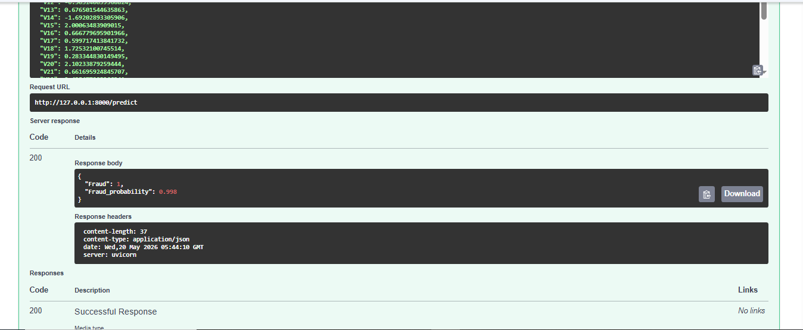

# Financial Fraud Detection System

A Financial Fraud Detection System built using **PyTorch**, **FastAPI**, and **Gradio**.

This project uses an Artificial Neural Network (ANN) trained on credit card transaction data to identify potentially fraudulent transactions. The application provides a FastAPI backend for serving predictions and a Gradio dashboard for batch CSV uploads and visualization of fraud detection results.

The goal of the project is to build a complete end-to-end machine learning solution that accepts transaction data, processes it through a trained neural network model, and returns fraud predictions along with probability scores.

---

# Features

- Fraud detection using a PyTorch Artificial Neural Network (ANN)
- FastAPI backend for real-time predictions
- Gradio dashboard for batch transaction uploads
- CSV-based prediction workflow
- Fraud probability scoring
- Interactive fraud prediction visualizations
- Simple deployment-ready architecture
- Modular project structure

---

# Screenshots

## FastAPI Prediction Endpoint


## FastAPI Response Example



## Gradio Dashboard


## Prediction Results Table


## Fraud Probability Visualizations


---

# Tech Stack

## Backend

- Python
- FastAPI
- Uvicorn

## Machine Learning

- PyTorch
- Pandas
- NumPy
- Joblib
- Scikit-learn

## Frontend

- Gradio

## Visualization

- Matplotlib
- Plotly

---

# Model Performance

The model was trained on a highly imbalanced fraud detection dataset.

| Metric | Score |
|----------|----------|
| Recall | 0.84 |
| F1-Score | 0.75 |

The primary objective was maximizing **Recall** to detect as many fraudulent transactions as possible while maintaining a reasonable balance with precision.

---

# Dataset

This project uses the **Credit Card Fraud Detection Dataset** from Kaggle:

https://www.kaggle.com/datasets/mlg-ulb/creditcardfraud

## Dataset Details

- 284,807 transactions
- Highly imbalanced classes
- PCA-transformed features (`V1` to `V28`)
- `Amount` represents transaction value
- `Time` represents seconds elapsed between transactions

### Target Variable

| Value | Meaning |
|---------|---------|
| 0 | Legitimate Transaction |
| 1 | Fraudulent Transaction |

---

# Project Structure

```text
Financial-Fraud-Detection-System/
│
├── api/
│   └── main.py
│
├── app/
│   └── gradio_app.py
│
├── model/
│   ├── model.pth
│   └── scaler.pkl
│
├── data/
│   └── creditcard.csv
│
├── screenshots/
│   ├── Fraud-Detection-FastAPI.png
│   ├── Fraud-Detection-FastAPI-Response.png
│   ├── Fraud-Detection-Gradio-UI.png
│   ├── Fraud-Detection-Gradio-UI-output.png
│   └── Fraud-Detection-Gradio-UI-graphs.png
│
├── requirements.txt
├── README.md
└── .gitignore
```

---

# Installation

## 1. Clone the Repository

```bash
git clone https://github.com/MohomedShajith/Financial-Fraud-Detection-System.git

cd Financial-Fraud-Detection-System
```

---

## 2. Create a Virtual Environment

### Windows

```bash
python -m venv venv

venv\Scripts\activate
```

### macOS / Linux

```bash
python3 -m venv venv

source venv/bin/activate
```

---

## 3. Install Dependencies

```bash
pip install -r requirements.txt
```

---

# Running the Project

## Start the FastAPI Server

```bash
uvicorn api.main:app --reload
```

The API will run at:

```text
http://127.0.0.1:8000
```

Swagger Documentation:

```text
http://127.0.0.1:8000/docs
```

---

## Start the Gradio Dashboard

```bash
python app/gradio_app.py
```

The Gradio interface will automatically launch in your browser.

---

# Batch Prediction Workflow

1. Export transaction records into a CSV file
2. Upload the CSV file through the Gradio dashboard
3. Transactions are automatically processed
4. Data is standardized using the saved scaler
5. Predictions are generated using the trained ANN model
6. Fraud probabilities are calculated
7. Results and visualizations are displayed

---

# Expected CSV Format

```text
Time,V1,V2,V3,...,V28,Amount
```

Optional Column:

```text
Class
```

If the `Class` column is included, it will automatically be ignored during prediction.

---

# Example API Request

```json
{
  "Time": 0,
  "V1": -1.359807,
  "V2": -0.072781,
  "V3": 2.536346,
  "Amount": 149.62
}
```

---

# Example API Response

```json
{
  "Fraud": 1,
  "Fraud_probability": 0.913
}
```

---

# Future Improvements

- Docker containerization
- Cloud deployment (AWS / Azure / GCP)
- Model monitoring and logging
- SHAP explainability integration
- Real-time transaction streaming
- Improved ANN architectures
- Database integration
- Authentication and API security
- Model retraining pipeline
- CI/CD deployment workflows

---

# Author

### Mohomed Shajith

GitHub Profile:

https://github.com/MohomedShajith

Project Repository:

https://github.com/MohomedShajith/Financial-Fraud-Detection-System

---

# License

This project is intended for educational and portfolio purposes.
